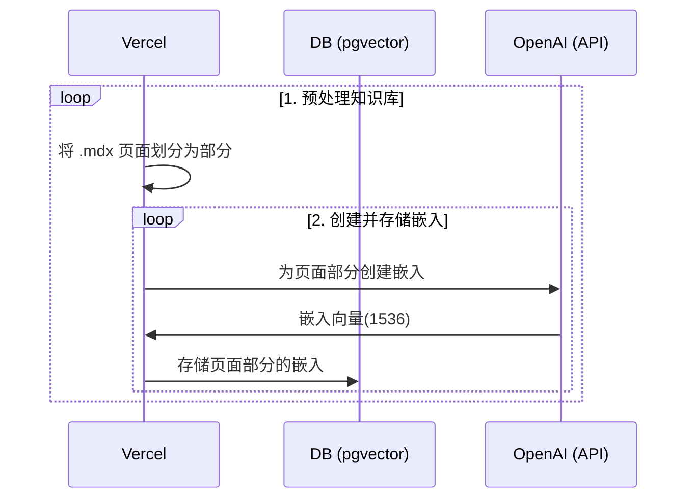
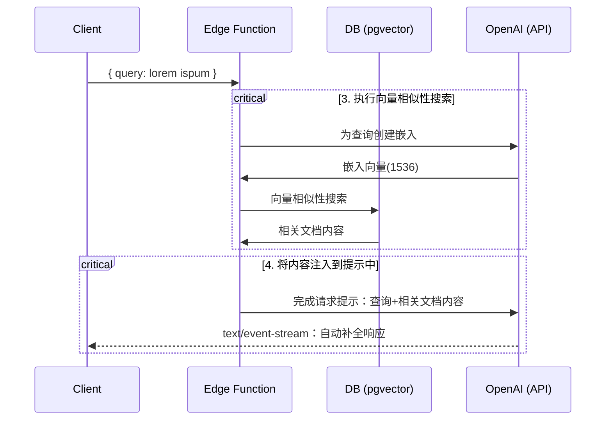

# 北大附中AI 助手

## 介绍
这个项目从 `pages` 目录中获取所有的 `.mdx` 文件，并使用 OpenAI Embeddings 计算文本矢量，以在[OpenAI ChatGPT API](https://platform.openai.com/docs/guides/completion) prompt 中使用。 
目前包括的文件：
 - 北大附中学生手册
 - 北大附中文凭方案
 - 北大附中社团运行和管理方案
 - 国际部选课说明
 - 国际部学生毕业要求

## 技术细节

1. [👷 Build Time] 预处理知识库（ `pages` 文件夹中的 `.mdx` 文件）
2. [👷 Build Time] 在 PostgreSQL 中使用 [pgvector](https://supabase.com/docs/guides/database/extensions/pgvector) 存储嵌入向量
3. [🏃 Runtime] 执行向量相似性搜索，查找与问题相关的内容
4. [🏃 Runtime] 将内容注入到 OpenAI GPT-3.5 文本自动补全中，并将响应流式传输到客户端

## 👷 Build Time

挡执行 [`generate-embeddings`](./lib/generate-embeddings.ts) 脚本，该脚本执行以下任务：



除了存储嵌入向量之外，此脚本还为每个 `.mdx` 文件生成一个校验和，并将其存储在另一个数据库表中，以确保仅当文件更改时才重新生成嵌入向量。

## 🏃 Runtime

在用户提交问题时，执行以下一系列任务：



相关文件 [`SearchDialog`](./components/SearchDialog.tsx) 组件和 [`vector-search`](./pages/api/vector-search.ts)

数据库的初始化，包括 `pgvector` 扩展的设置存储在 [`supabase/migrations`文件夹](./supabase/migrations/) 中，并在运行 `supabase start` 时自动应用于本地 PostgreSQL 实例

## 本地开发

### 配置开发环境
1. 安装 [Node.js](https://nodejs.org/en/download/) (LTS)
2. ```bash
   npm install -g pnpm
   ```
### 配置
- `cd 项目文件夹`
- `pnpm install`
- `cp .env.example .env`
- 在新创建的 `.env` 文件中输入 `OPENAI_KEY`。

### 启动 Supabase

确保已安装并在本地运行 Docker。然后运行

```bash
npx supabase start
```

### 启动 Next.js 应用程序

在新的终端窗口中运行

```bash
pnpm dev
```
